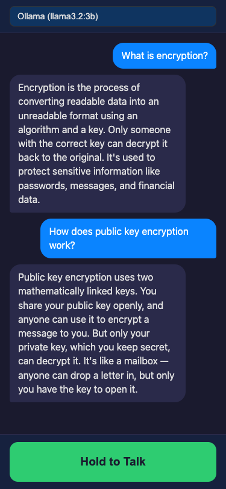
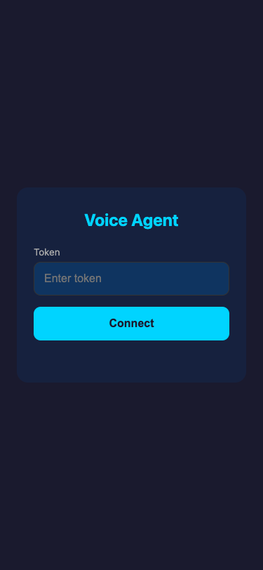
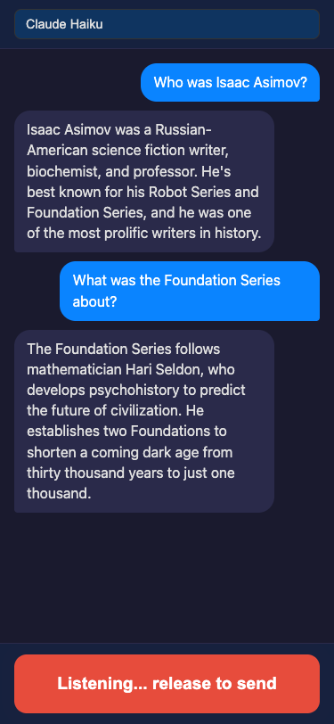

# Voice Agent — WebRTC + TURN Speaker Streaming

Voice agent running on a Mac host: speak into iPhone mic → Whisper STT → LLM (Claude/OpenAI/Ollama) → Piper TTS → hear response through iPhone speaker via WebRTC.

| Voice Agent (Ollama) | Connect | Recording |
|:---:|:---:|:---:|
|  |  |  |

Works with **Ollama** (free, local), **Claude** (Anthropic API), or **OpenAI** — switchable at runtime from the dropdown.

## Architecture

```
┌──────────────────────────────────────────────────────┐
│  Mac Host                                            │
│                                                      │
│  ┌────────────┐    ┌───────────────────────────────┐ │
│  │   Engine    │    │          Gateway              │ │
│  │            │    │                               │ │
│  │ Piper TTS  │───▶│  aiohttp server (:8080)       │ │
│  │ 22kHz→48kHz│    │  ├─ GET /  → index.html       │ │
│  │            │    │  ├─ GET /ws → WebSocket        │ │
│  │ Whisper STT│◀───│  │    signaling + agent loop   │ │
│  │ 48kHz→16kHz│    │  └─ RTCPeerConnection          │ │
│  │            │    │     ├─ AudioTrack out (TTS)     │ │
│  │ LLM        │◀──▶│     └─ AudioTrack in  (mic)     │ │
│  │ Claude /   │    │                                 │ │
│  │ OpenAI /   │    │                                 │ │
│  │ Ollama     │    │                                 │ │
│  └────────────┘    └───────────────────────────────┘ │
└──────────────────────┬───────────────────────────────┘
                       │  WebRTC (UDP)
                       │  via TURN relay or direct
                       │
┌──────────────────────▼───────────────────────────────┐
│  iPhone Safari / Chrome                              │
│                                                      │
│  ┌───────────────────────────────────────────────┐   │
│  │  web/app.js                                   │   │
│  │  ├─ WebSocket signaling                       │   │
│  │  ├─ RTCPeerConnection (sendrecv)              │   │
│  │  ├─ getUserMedia (mic) → send audio track     │   │
│  │  ├─ Hold-to-talk UI                           │   │
│  │  └─ Chat bubble conversation display          │   │
│  └───────────────────────────────────────────────┘   │
└──────────────────────────────────────────────────────┘
```

### Voice Agent Loop

```
User holds button → mic audio streams via WebRTC
         │
         ▼
   Whisper STT (~1-2s) → transcribed text
         │
         ▼
   LLM generate (~0.3-1.5s) → reply text
         │
         ▼
   Piper TTS per sentence → audio queue → WebRTC → speaker
```

### NAT Traversal with TURN

```
iPhone (cellular)                    Twilio TURN                    Mac (behind NAT)
       │                                │                                │
       │── STUN discover public IP ────▶│                                │
       │◀── relay candidate ────────────│                                │
       │                                │◀── STUN discover public IP ────│
       │                                │── relay candidate ────────────▶│
       │                                │                                │
       │◀═══════ WebRTC audio (UDP) ═══▶│◀═══════ WebRTC audio (UDP) ══▶│
       │         via TURN relay         │         via TURN relay         │
```

## Quick Start

```bash
# Install Python dependencies
pip install -r requirements.txt

# Create .env from template
cp .env.example .env

# Add your LLM API key (at least one)
echo 'ANTHROPIC_API_KEY=sk-ant-...' >> .env   # Claude Haiku
# OR
echo 'OPENAI_API_KEY=sk-...' >> .env          # GPT-4o-mini
# OR just use Ollama (free, local):
brew install ollama && ollama pull llama3.2:3b

# Run the server
python3 -m gateway.server

# Open in browser
open http://localhost:8080
```

## Usage

### Local (Mac browser)

```bash
bash scripts/test_local.sh
# Opens http://localhost:8080
```

### LAN (iPhone on same Wi-Fi)

```bash
bash scripts/test_lan.sh
```

Starts HTTPS server with a self-signed cert (required for mic access), detects your LAN IP, and prints a URL + QR code. On your iPhone:

1. Open the `https://192.168.x.x:8080` URL in Safari
2. Tap through the certificate warning: **Show Details** → **visit this website** → **Visit Website**
3. Enter the auth token and tap **Connect**
4. Hold the green button to talk, release to send

### Cellular (iPhone on AT&T / any network)

```bash
brew install cloudflared   # one-time setup
bash scripts/test_cellular.sh
```

Starts a Cloudflare Tunnel providing a public HTTPS URL. Open the `https://xxx.trycloudflare.com` URL on your iPhone. TURN relay (Twilio) is recommended for reliable cellular NAT traversal.

## Signaling Protocol (WebSocket JSON)

```
Client                          Server
  │                               │
  │─── hello {token} ───────────▶│   Auth check
  │◀── hello_ack {voices,        │   Voice list + TURN creds
  │     ice_servers,              │   + LLM provider list
  │     llm_providers} ──────────│
  │                               │
  │─── webrtc_offer {sdp} ──────▶│   Set remote, create answer
  │◀── webrtc_answer {sdp} ──────│   ICE candidates bundled in SDP
  │                               │
  │─── set_provider {provider} ─▶│   Switch LLM (claude/openai/ollama)
  │◀── provider_set {provider} ──│
  │                               │
  │─── mic_start ───────────────▶│   Start buffering mic audio
  │◀── transcription {text,      │   Partial transcriptions (every 5s)
  │     partial:true} ────────────│
  │─── mic_stop ────────────────▶│   Final STT → LLM → TTS
  │◀── transcription {text} ─────│   Final transcribed text
  │◀── agent_thinking ───────────│   LLM is generating
  │◀── agent_reply {text} ───────│   LLM response text
  │    (TTS audio plays via WebRTC)
  │                               │
  │─── stop_speaking ───────────▶│   Interrupt TTS playback
  │─── ping ─────────────────────▶│   Keepalive
  │◀── pong ──────────────────────│
```

## Project Structure

```
├── engine/                  # Audio + AI layer
│   ├── types.py             # VoiceInfo, AudioChunk dataclasses
│   ├── adapter.py           # list_voices(), SineWaveGenerator
│   ├── tts.py               # Piper TTS (text → 48kHz PCM)
│   ├── stt.py               # Whisper STT (48kHz PCM → text)
│   ├── llm.py               # LLM wrapper (Claude / OpenAI / Ollama)
│   └── conversation.py      # Conversation history (10-turn window)
│
├── gateway/                 # Server + WebRTC layer
│   ├── server.py            # aiohttp HTTP/HTTPS + WS + agent loop
│   ├── webrtc.py            # Session, RTCPeerConnection, mic, TTS queue
│   ├── turn.py              # Twilio TURN credential fetching
│   ├── cert.py              # Self-signed HTTPS cert for LAN testing
│   └── audio/
│       ├── audio_queue.py           # Thread-safe FIFO for TTS sentences
│       ├── pcm_ring_buffer.py       # Thread-safe ring buffer (legacy)
│       └── webrtc_audio_source.py   # Custom MediaStreamTrack
│
├── web/                     # Browser client
│   ├── index.html           # Two-screen mobile UI
│   ├── app.js               # WS signaling + WebRTC + hold-to-talk
│   └── styles.css           # Mobile-first dark theme
│
├── scripts/                 # Testing & tooling
│   ├── smoke_test.py        # Headless TTS + STT pipeline test
│   ├── test_local.sh        # Local browser test
│   ├── test_lan.sh          # iPhone on same Wi-Fi
│   ├── test_cellular.sh     # iPhone on cellular (cloudflared tunnel)
│   ├── build-index.sh       # Project memory index builder
│   └── setup-hooks.sh       # Git pre-commit hook installer
│
├── docs/
│   ├── screenshots/         # UI screenshots
│   └── project-memory/      # Session docs, ADRs, architecture
│
├── CLAUDE.md                # AI project guide + memory system rules
├── requirements.txt         # Python dependencies
├── .env.example             # Environment variable template
└── README.md                # This file
```

## Milestones

| # | Goal | Status | Acceptance |
|---|------|--------|------------|
| 1 | Gateway + Signaling | Done | Open localhost:8080, enter token, see voices list |
| 2 | WebRTC Negotiation | Done | Offer/answer exchange, ICE completes |
| 3 | Sine Wave Streaming | Done | Click Start → hear tone |
| 3b | TURN Relay Support | Done | Twilio TURN, works over cellular |
| 4a | TTS → WebRTC Pipeline | Done | Type text → hear Piper TTS voice |
| 5 | iPhone Mic → STT | Done | Record → see transcribed text (Whisper STT) |
| 6 | Voice Agent Loop | Done | Speak → STT → LLM → TTS → hear reply |

## Environment Variables

| Variable | Default | Description |
|----------|---------|-------------|
| `PORT` | `8080` | Server listen port |
| `AUTH_TOKEN` | `devtoken` | Token required in `hello` message |
| `LLM_PROVIDER` | (auto) | `claude`, `openai`, or `ollama` (auto-detects from API keys) |
| `ANTHROPIC_API_KEY` | — | Anthropic API key (enables Claude Haiku) |
| `OPENAI_API_KEY` | — | OpenAI API key (enables GPT-4o-mini) |
| `OPENAI_MODEL` | `gpt-4o-mini` | OpenAI model to use |
| `OLLAMA_MODEL` | `llama3.2:3b` | Ollama model to use |
| `OLLAMA_URL` | `http://localhost:11434` | Ollama server URL |
| `SYSTEM_PROMPT` | (built-in) | Custom system prompt for the voice agent |
| `TWILIO_ACCOUNT_SID` | — | Twilio Account SID (for TURN credentials) |
| `TWILIO_AUTH_TOKEN` | — | Twilio Auth Token (for TURN credentials) |
| `ICE_SERVERS_JSON` | `[]` | Manual ICE server fallback |
| `HTTPS` | — | Set to `1` for self-signed HTTPS (LAN mic access) |
| `LOCAL_IP` | `192.168.1.1` | LAN IP for self-signed cert SAN |

## Key Technical Decisions

| Decision | Choice | Why |
|----------|--------|-----|
| TTS engine | Piper TTS (ONNX) | Fast offline neural TTS, no API keys needed |
| TTS buffering | Sentence-level FIFO queue | Split reply into sentences, TTS each, queue for playback. First sentence plays while later ones synthesize. No audio lost (unlike ring buffer). |
| STT engine | faster-whisper (base, int8) | 4x faster than openai/whisper, CPU mode, ~75MB |
| LLM provider | Claude / OpenAI / Ollama | Switchable at runtime from mobile UI. Auto-detects from API keys. |
| Agent loop | Simple: full STT → full LLM → full TTS | ~2-4s latency. Foundation for future streaming pipeline. |
| Audio sample rate | 48 kHz | Opus codec native rate |
| Frame size | 960 samples (20 ms) | Matches aiortc `AUDIO_PTIME` |
| Resampling | scipy.signal.resample | Piper outputs 22050Hz, WebRTC needs 48000Hz |
| ICE strategy | Client waits for gathering complete | aiortc has no trickle ICE |
| TURN credentials | Twilio NTS, fetched per-connection | Ephemeral creds, no static secrets in client |
| Mobile UI | Two-screen, hold-to-talk | Connect screen → agent screen. Walkie-talkie UX. |
| Remote access | Cloudflare Tunnel | Free, no domain needed, handles HTTPS + WSS |

## iOS Safari Notes

- Audio autoplay is blocked until a user gesture — Connect button click triggers `audio.play()`
- `getUserMedia` requires HTTPS (or localhost) — LAN test uses self-signed cert
- Hold-to-talk uses `touchstart`/`touchend` events (not `click`) for zero-delay response
- Uses `<audio>` element (not AudioContext) for maximum mobile compatibility
- CSS uses `100dvh` for proper height with Safari's dynamic toolbar
- `env(safe-area-inset-bottom)` respects iPhone home indicator area
- `playsinline` attribute is required for inline audio on iOS
