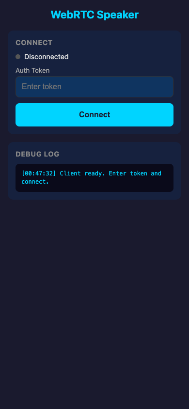
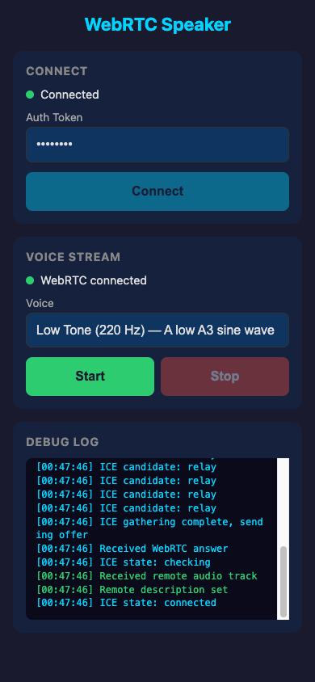
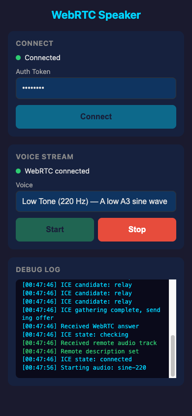

# WebRTC + TURN Speaker Streaming

Stream generated audio from a Mac host to an iPhone browser client via WebRTC, with TURN relay support for NAT traversal.

| Initial | Connected (TURN) | Streaming |
|:---:|:---:|:---:|
|  |  |  |

## Architecture

```
┌──────────────────────────────────────────────────────┐
│  Mac Host                                            │
│                                                      │
│  ┌────────────┐    ┌───────────────────────────────┐ │
│  │   Engine    │    │          Gateway              │ │
│  │            │    │                               │ │
│  │ SineWave / │───▶│  aiohttp server (:8080)       │ │
│  │ TTS gen    │    │  ├─ GET /  → index.html       │ │
│  │            │    │  ├─ GET /ws → WebSocket        │ │
│  └────────────┘    │  │    ├─ hello / hello_ack    │ │
│                    │  │    ├─ webrtc_offer/answer   │ │
│                    │  │    └─ start / stop          │ │
│                    │  │                             │ │
│                    │  └─ RTCPeerConnection          │ │
│                    │     └─ AudioTrack (Opus 48kHz) │ │
│                    └───────────────────────────────┘ │
└──────────────────────┬───────────────────────────────┘
                       │  WebRTC (UDP)
                       │  via TURN relay or direct
                       │
┌──────────────────────▼───────────────────────────────┐
│  iPhone Safari                                       │
│                                                      │
│  ┌───────────────────────────────────────────────┐   │
│  │  web/app.js                                   │   │
│  │  ├─ WebSocket signaling                       │   │
│  │  ├─ RTCPeerConnection (recvonly)              │   │
│  │  └─ <audio> element playback                  │   │
│  └───────────────────────────────────────────────┘   │
└──────────────────────────────────────────────────────┘
```

### NAT Traversal with TURN

When the server is behind NAT (e.g. a home Mac), direct WebRTC UDP connections from remote clients will fail. A TURN relay solves this:

```
iPhone (cellular)                    Twilio TURN                    Mac (behind NAT)
       │                                │                                │
       │── STUN discover public IP ────▶│                                │
       │◀── relay candidate ────────────│                                │
       │                                │◀── STUN discover public IP ────│
       │                                │── relay candidate ────────────▶│
       │                                │                                │
       │◀═══════ WebRTC audio (UDP) ═══▶│◀═══════ WebRTC audio (UDP) ══▶│
       │         via TURN relay         │         via TURN relay         │
```

The server fetches ephemeral TURN credentials from Twilio on each connection and sends them to the client in the `hello_ack` message. Both sides use these credentials for ICE negotiation.

## Signaling Protocol (WebSocket JSON)

```
Client                          Server
  │                               │
  │─── hello {token} ───────────▶│   Auth check
  │◀── hello_ack {voices,        │   Voice list + TURN creds
  │     ice_servers} ─────────────│
  │                               │
  │─── webrtc_offer {sdp} ──────▶│   Set remote, create answer
  │◀── webrtc_answer {sdp} ──────│   ICE candidates bundled in SDP
  │                               │
  │─── start {voice_id} ────────▶│   Begin audio generation
  │─── stop ─────────────────────▶│   Stop audio generation
  │                               │
  │─── ping ─────────────────────▶│   Keepalive
  │◀── pong ──────────────────────│
```

**Key constraint**: aiortc does NOT support trickle ICE. All ICE candidates are bundled into the SDP answer. The client waits for ICE gathering to complete before sending its offer.

## Project Structure

```
├── engine/                  # Audio generation layer
│   ├── types.py             # VoiceInfo, AudioChunk dataclasses
│   └── adapter.py           # list_voices(), SineWaveGenerator
│
├── gateway/                 # Server + WebRTC layer
│   ├── server.py            # aiohttp HTTP + WS server
│   ├── webrtc.py            # Session, RTCPeerConnection lifecycle
│   ├── turn.py              # Twilio TURN credential fetching
│   └── audio/
│       ├── pcm_ring_buffer.py        # Thread-safe ring buffer
│       └── webrtc_audio_source.py    # Custom MediaStreamTrack
│
├── web/                     # Browser client
│   ├── index.html           # Mobile-friendly UI
│   ├── app.js               # WS signaling + WebRTC + playback
│   └── styles.css           # Mobile CSS with large touch targets
│
├── web-app/                 # Iris Kade (existing, untouched)
│
├── requirements.txt         # Python dependencies
├── .env.example             # Environment variable template
└── README.md                # This file
```

## Milestones

| # | Goal | Status | Acceptance |
|---|------|--------|------------|
| 1 | Gateway + Signaling | Done | Open localhost:8080, enter token, see voices list |
| 2 | WebRTC Negotiation | Done | Offer/answer exchange, ICE completes, "WebRTC connected" in UI |
| 3 | Sine Wave Streaming | Done | Click Start → hear tone, Stop → silence, switch voice → different frequency |
| 3b | TURN Relay Support | Done | Twilio TURN credentials, relay ICE candidates, works over cellular |
| 4 | Real TTS (future) | — | Replace sine wave with actual TTS engine output |

## Quick Start

```bash
# Install Python dependencies
pip install -r requirements.txt

# Create .env from template
cp .env.example .env
# Edit .env to set AUTH_TOKEN and Twilio credentials

# Run the server
python3 -m gateway.server

# Open in browser
open http://localhost:8080
```

### Testing from iPhone (same Wi-Fi)

1. Find your Mac's IP: `ipconfig getifaddr en0`
2. Open `http://<mac-ip>:8080` in Safari on iPhone
3. Enter the auth token and tap Connect
4. Select a voice and tap Start

### Testing from iPhone (cellular / remote)

Your Mac is behind NAT, so remote clients need two things:
- **Cloudflare Tunnel** — for the web page and WebSocket signaling
- **Twilio TURN** — for WebRTC audio relay

```bash
# Terminal 1: run the server
python3 -m gateway.server

# Terminal 2: expose via Cloudflare Tunnel
cloudflared tunnel --url http://localhost:8080 --protocol http2
# Gives you: https://random-name.trycloudflare.com
```

On your iPhone (Wi-Fi off, cellular only):
1. Open the `https://...trycloudflare.com` URL in Safari
2. Enter the auth token, tap Connect
3. Debug log should show **relay** ICE candidates (TURN working)
4. Select a voice, tap Start — hear the tone over cellular

## Environment Variables

| Variable | Default | Description |
|----------|---------|-------------|
| `PORT` | `8080` | Server listen port |
| `AUTH_TOKEN` | `devtoken` | Token required in `hello` message |
| `TWILIO_ACCOUNT_SID` | — | Twilio Account SID (for TURN credentials) |
| `TWILIO_AUTH_TOKEN` | — | Twilio Auth Token (for TURN credentials) |
| `ICE_SERVERS_JSON` | `[]` | Manual ICE server fallback (used if Twilio not configured) |

### Twilio TURN Setup

1. Sign up at https://www.twilio.com
2. Get **Account SID** and **Auth Token** from the [console dashboard](https://www.twilio.com/console)
3. Add to `.env`:
   ```
   TWILIO_ACCOUNT_SID=ACxxxxxxxxxxxxxxxxxxxxxxxxxxxxxxxx
   TWILIO_AUTH_TOKEN=your_auth_token_here
   ```
4. The server auto-fetches ephemeral TURN/STUN credentials on each connection (24hr TTL)

## Key Technical Decisions

| Decision | Choice | Why |
|----------|--------|-----|
| Server framework | aiohttp + aiortc | Most mature Python server-side WebRTC |
| Audio sample rate | 48 kHz | Opus codec native rate, no resampling |
| Frame size | 960 samples (20 ms) | Matches aiortc `AUDIO_PTIME` |
| ICE strategy | Client waits for gathering complete | aiortc has no trickle ICE |
| TURN credentials | Twilio NTS, fetched per-connection | Ephemeral creds, no static secrets in client |
| Auth | Token in WS `hello` message | Simple, avoids HTTP header complexity |
| Audio playback | `<audio>` element | Simplest iOS Safari compatibility |
| Remote access | Cloudflare Tunnel | Free, no domain needed, handles HTTPS + WSS |

## iOS Safari Notes

- Audio autoplay is blocked until a user gesture — the Start button click triggers `audio.play()`
- Uses `<audio>` element (not AudioContext) for maximum mobile compatibility
- CSS uses large touch targets (min 44px) for iPhone usability
- `playsinline` attribute is required for inline audio on iOS

## Existing: Iris Kade Web App

The `web-app/` directory contains the original Iris Kade conversational AI — a fully local browser-based system using WebGPU. It is independent of the WebRTC streaming system. See `web-app/` for its own documentation.
