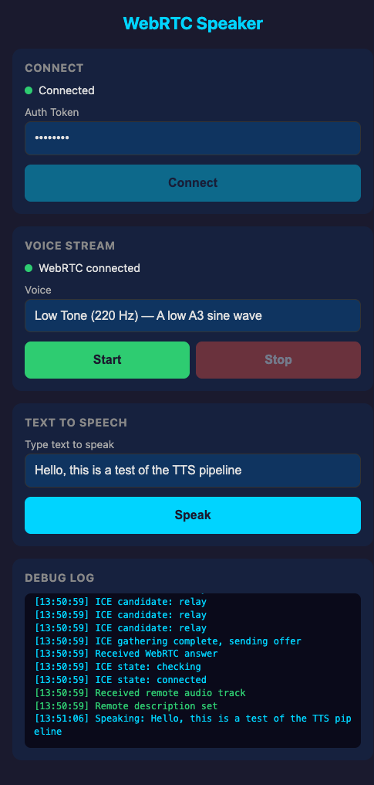

# WebRTC + TURN Speaker Streaming

Stream generated audio from a Mac host to an iPhone browser client via WebRTC, with TURN relay support for NAT traversal.

| Connected + TTS |
|:---:|
|  |

## Architecture

```
┌──────────────────────────────────────────────────────┐
│  Mac Host                                            │
│                                                      │
│  ┌────────────┐    ┌───────────────────────────────┐ │
│  │   Engine    │    │          Gateway              │ │
│  │            │    │                               │ │
│  │ Piper TTS  │───▶│  aiohttp server (:8080)       │ │
│  │ 22kHz→48kHz│    │  ├─ GET /  → index.html       │ │
│  │ resampling │    │  ├─ GET /ws → WebSocket        │ │
│  └────────────┘    │  │    ├─ hello / hello_ack    │ │
│       │            │  │    ├─ webrtc_offer/answer   │ │
│       ▼            │  │    ├─ start / stop          │ │
│  ┌────────────┐    │  │    └─ speak {text}          │ │
│  │ PCMRing    │    │  │                             │ │
│  │ Buffer     │───▶│  └─ RTCPeerConnection          │ │
│  └────────────┘    │     └─ AudioTrack (Opus 48kHz) │ │
│                    └───────────────────────────────┘ │
└──────────────────────┬───────────────────────────────┘
                       │  WebRTC (UDP)
                       │  via TURN relay or direct
                       │
┌──────────────────────▼───────────────────────────────┐
│  iPhone Safari                                       │
│                                                      │
│  ┌───────────────────────────────────────────────┐   │
│  │  web/app.js                                   │   │
│  │  ├─ WebSocket signaling                       │   │
│  │  ├─ RTCPeerConnection (recvonly)              │   │
│  │  └─ <audio> element playback                  │   │
│  └───────────────────────────────────────────────┘   │
└──────────────────────────────────────────────────────┘
```

### NAT Traversal with TURN

When the server is behind NAT (e.g. a home Mac), direct WebRTC UDP connections from remote clients will fail. A TURN relay solves this:

```
iPhone (cellular)                    Twilio TURN                    Mac (behind NAT)
       │                                │                                │
       │── STUN discover public IP ────▶│                                │
       │◀── relay candidate ────────────│                                │
       │                                │◀── STUN discover public IP ────│
       │                                │── relay candidate ────────────▶│
       │                                │                                │
       │◀═══════ WebRTC audio (UDP) ═══▶│◀═══════ WebRTC audio (UDP) ══▶│
       │         via TURN relay         │         via TURN relay         │
```

The server fetches ephemeral TURN credentials from Twilio on each connection and sends them to the client in the `hello_ack` message. Both sides use these credentials for ICE negotiation.

## Signaling Protocol (WebSocket JSON)

```
Client                          Server
  │                               │
  │─── hello {token} ───────────▶│   Auth check
  │◀── hello_ack {voices,        │   Voice list + TURN creds
  │     ice_servers} ─────────────│
  │                               │
  │─── webrtc_offer {sdp} ──────▶│   Set remote, create answer
  │◀── webrtc_answer {sdp} ──────│   ICE candidates bundled in SDP
  │                               │
  │─── start {voice_id} ────────▶│   Begin sine wave audio
  │─── stop ─────────────────────▶│   Stop audio generation
  │                               │
  │─── speak {text} ─────────────▶│   TTS → ring buffer → WebRTC
  │                               │
  │─── ping ─────────────────────▶│   Keepalive
  │◀── pong ──────────────────────│
```

**Key constraint**: aiortc does NOT support trickle ICE. All ICE candidates are bundled into the SDP answer. The client waits for ICE gathering to complete before sending its offer.

## Project Structure

```
├── engine/                  # Audio generation layer
│   ├── types.py             # VoiceInfo, AudioChunk dataclasses
│   ├── adapter.py           # list_voices(), SineWaveGenerator
│   └── tts.py               # Piper TTS (text → 48kHz PCM)
│
├── gateway/                 # Server + WebRTC layer
│   ├── server.py            # aiohttp HTTP + WS server
│   ├── webrtc.py            # Session, RTCPeerConnection, BufferedGenerator
│   ├── turn.py              # Twilio TURN credential fetching
│   └── audio/
│       ├── pcm_ring_buffer.py        # Thread-safe ring buffer
│       └── webrtc_audio_source.py    # Custom MediaStreamTrack
│
├── web/                     # Browser client
│   ├── index.html           # Mobile-friendly UI
│   ├── app.js               # WS signaling + WebRTC + playback
│   └── styles.css           # Mobile CSS with large touch targets
│
├── scripts/                 # Testing & tooling
│   ├── smoke_test.py        # Headless TTS pipeline test (26 tests)
│   ├── test_local.sh        # Local browser test
│   ├── test_lan.sh          # iPhone on same Wi-Fi
│   ├── test_cellular.sh     # iPhone on cellular (cloudflared tunnel)
│   ├── build-index.sh       # Project memory index builder
│   └── setup-hooks.sh       # Git pre-commit hook installer
│
├── docs/
│   ├── screenshots/         # UI screenshots
│   └── project-memory/      # Session docs, ADRs, architecture
│
├── .github/
│   └── PULL_REQUEST_TEMPLATE.md
│
├── CLAUDE.md                # AI project guide + memory system rules
├── requirements.txt         # Python dependencies
├── .env.example             # Environment variable template
└── README.md                # This file
```

## Milestones

| # | Goal | Status | Acceptance |
|---|------|--------|------------|
| 1 | Gateway + Signaling | Done | Open localhost:8080, enter token, see voices list |
| 2 | WebRTC Negotiation | Done | Offer/answer exchange, ICE completes, "WebRTC connected" in UI |
| 3 | Sine Wave Streaming | Done | Click Start → hear tone, Stop → silence, switch voice → different frequency |
| 3b | TURN Relay Support | Done | Twilio TURN credentials, relay ICE candidates, works over cellular |
| 4a | TTS → WebRTC Pipeline | Done | Type text, click Speak → hear Piper TTS voice through WebRTC |

## Testing

### Smoke Test (headless, no browser)

```bash
python3 scripts/smoke_test.py
```

Tests the full pipeline without a browser — 26 tests across 4 areas:

| Suite | What it tests |
|-------|--------------|
| TTS synthesize | Piper TTS → valid 48kHz PCM output |
| PCMRingBuffer | Write/read, zero-padding, overflow, clear |
| BufferedGenerator | 20ms chunk framing, data integrity, silence on empty |
| WAV output | Saves `logs/smoke_test.wav`, validates format |

### Local Test (Mac browser)

```bash
bash scripts/test_local.sh
```

Starts the server, opens `http://localhost:8080`, tails logs.

### LAN Test (iPhone on same Wi-Fi)

```bash
bash scripts/test_lan.sh
```

Detects your Mac's LAN IP, prints a QR code to scan on iPhone.

### Cellular Test (iPhone on AT&T / cellular)

```bash
bash scripts/test_cellular.sh
```

Starts a Cloudflare Tunnel (HTTPS), prints QR code. Requires `brew install cloudflared`.

### Test Results (2026-02-14)

| Test | Result |
|------|--------|
| `smoke_test.py` | 26/26 PASS |
| `test_local.sh` | Audio heard in Mac browser |
| `test_lan.sh` | Audio heard on iPhone (Wi-Fi) |
| `test_cellular.sh` | Audio heard on iPhone (cellular) |

## Quick Start

```bash
# Install Python dependencies
pip install -r requirements.txt

# Create .env from template
cp .env.example .env
# Edit .env to set AUTH_TOKEN and Twilio credentials

# Run the server
python3 -m gateway.server

# Open in browser
open http://localhost:8080
```

## Environment Variables

| Variable | Default | Description |
|----------|---------|-------------|
| `PORT` | `8080` | Server listen port |
| `AUTH_TOKEN` | `devtoken` | Token required in `hello` message |
| `TWILIO_ACCOUNT_SID` | — | Twilio Account SID (for TURN credentials) |
| `TWILIO_AUTH_TOKEN` | — | Twilio Auth Token (for TURN credentials) |
| `ICE_SERVERS_JSON` | `[]` | Manual ICE server fallback (used if Twilio not configured) |

### Twilio TURN Setup

1. Sign up at https://www.twilio.com
2. Get **Account SID** and **Auth Token** from the [console dashboard](https://www.twilio.com/console)
3. Add to `.env`:
   ```
   TWILIO_ACCOUNT_SID=ACxxxxxxxxxxxxxxxxxxxxxxxxxxxxxxxx
   TWILIO_AUTH_TOKEN=your_auth_token_here
   ```
4. The server auto-fetches ephemeral TURN/STUN credentials on each connection (24hr TTL)

## Key Technical Decisions

| Decision | Choice | Why |
|----------|--------|-----|
| TTS engine | Piper TTS (ONNX) | Fast offline neural TTS, no API keys needed |
| Audio sample rate | 48 kHz | Opus codec native rate |
| Frame size | 960 samples (20 ms) | Matches aiortc `AUDIO_PTIME` |
| TTS → WebRTC bridge | PCMRingBuffer | Thread-safe: TTS runs in thread pool, WebRTC reads in async loop |
| Resampling | scipy.signal.resample | Piper outputs 22050Hz, WebRTC needs 48000Hz |
| ICE strategy | Client waits for gathering complete | aiortc has no trickle ICE |
| TURN credentials | Twilio NTS, fetched per-connection | Ephemeral creds, no static secrets in client |
| Auth | Token in WS `hello` message | Simple, avoids HTTP header complexity |
| Remote access | Cloudflare Tunnel | Free, no domain needed, handles HTTPS + WSS |

## iOS Safari Notes

- Audio autoplay is blocked until a user gesture — the Start button click triggers `audio.play()`
- Uses `<audio>` element (not AudioContext) for maximum mobile compatibility
- CSS uses large touch targets (min 44px) for iPhone usability
- `playsinline` attribute is required for inline audio on iOS
